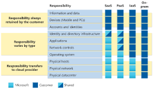

# Cloud Computing

## Learning objectives
> After completing this module, you’ll be able to:

- Define cloud computing.
- Describe the shared responsibility model.
- Define cloud models, including public, private, and hybrid.
- Identify appropriate use cases for each cloud model.
- Describe the consumption-based model.
- Compare cloud pricing models.

## Responsibilty Shared model

  

You’ll always be responsible for:

- The __information and data__ stored in the cloud
- __Devices__ that are allowed to connect to your cloud (cell phones, computers, and so on)
- The __accounts and identities__ of the people, services, and devices within your organization

- The cloud provider is always responsible for:

- The physical datacenter
- The physical network
- The physical hosts

Your service model will determine responsibility for things like:

- Operating systems
- Network controls
- Applications
- Identity and infrastructure

## Cloud Models
> The cloud models define the deployment type of cloud resources. The three main cloud models are: private, public, and hybrid.

### Private cloud
 A private cloud is, in some ways, the natural evolution from a corporate datacenter. It’s a cloud (delivering IT services over the internet) that’s used by a single entity.

 Private cloud provides much greater control for the company and its IT department. However, it also comes with greater cost and fewer of the benefits of a public cloud deployment. 

  Finally, a private cloud may be hosted from your on site datacenter. It may also be hosted in a dedicated datacenter offsite, potentially even by a third party that has dedicated that datacenter to your company.

  ### Public cloud
  A public cloud is built, controlled, and maintained by a __third-party__ cloud provider. With a public cloud, anyone that wants to purchase cloud services can access and use resources. The __general public availability__ is a key difference between public and private clouds.

  ### Hybrid cloud

  A hybrid cloud is a computing environment that uses both __public and private__ clouds in an inter-connected environment. A hybrid cloud environment can be used to allow a private cloud to surge for increased, temporary demand by deploying public cloud resources. Hybrid cloud can be used to provide an __extra layer of security__. For example, users can flexibly choose which services to keep in public cloud and which to deploy to their private cloud infrastructure.