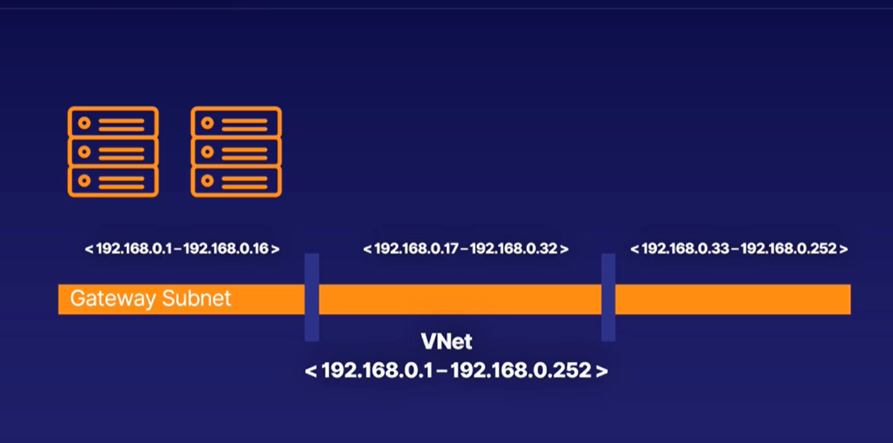
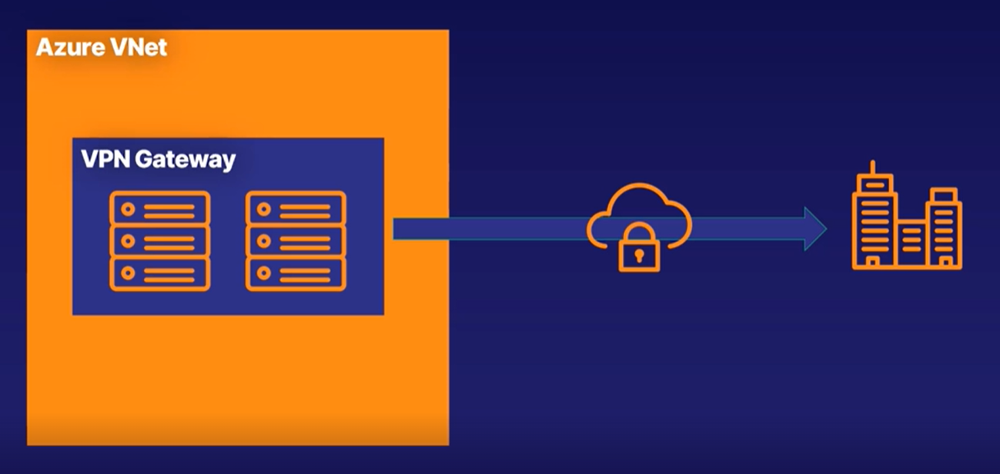
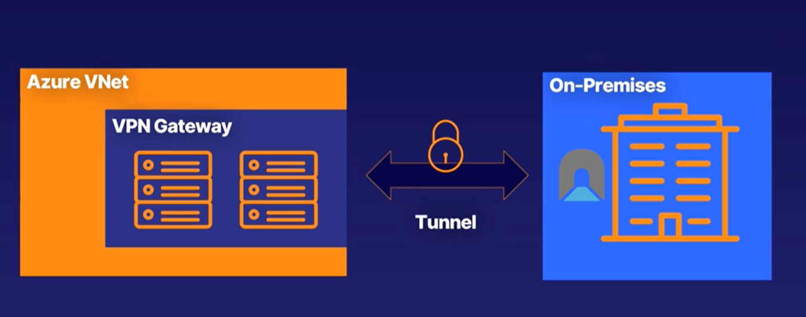

# VPN Gateway
> When you need to secure the communications between azure resources and your on-premises network (VPN Network to help)

- Responsibility => Enabling (Hybrid cloud)
- VPN gateway is a specific VNet Gateway, Consists of tow or more dedicated VMs
- VNet Gateway + "VPN" = VPN Gateway
- Sends encrypted data between azure and On-Premises networks
## Virtual Network Gateway

- A VNet Gatway is composed from 2 or more virtual machines deployed to specific subnet => Gateway Subnet
  

> VPN Gateway is a specific type of Virtual network gateway used to send encrypted traffic between azure VNet and on-premises over public internet

  

## Site to Site connection

### Main Componenets
- Azure VNet with VPN Gateway as specific type of VNet Gatways have a public Ip address
- A secure connection called __tunnel__ have encryption mechanism
- On-Premises network with a complementary gateway that can accept encrypted data

  

If a VPN gateway connected with multi On-Premises network => MultiSite-connection

