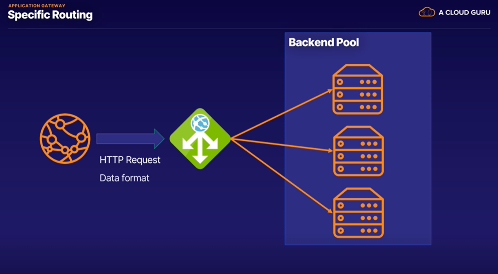

# Application Gateway
> is a specific use for load balancer to forward the traffic not to the VMs but the applications inside VM like Http requests
  

- Application Gateway is a higher level load balancer
- Works on Http requests of the traffic, instead of the IP address and port.

## Benefits 
- Scale Up/Down based on amount of traffic
- End to End Encryption => Comply with any security policies
- Zone Redundancy => Span multiple aviliability zones and improve fault reseliency
- Multi-Site Hosting => Use the same application gateway for up to 100 websites
